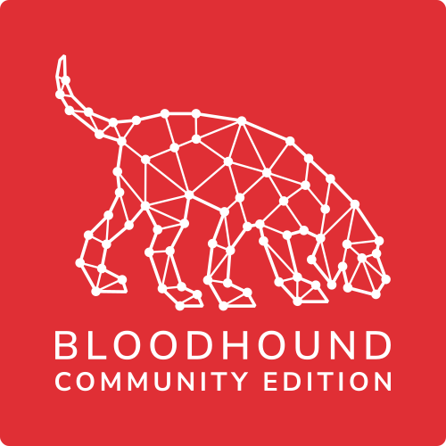

<p align="center">
    <picture>
    <source media="(prefers-color-scheme: dark)" srcset="cmd/ui/public/img/BloodHoundCE_Color.svg">
        
    </picture>
</p>

<hr />

BloodHound is a monolithic web application composed of an embedded React frontend with [Sigma.js](https://www.sigmajs.org/) and a [Go](https://go.dev/) based REST API backend. It is deployed with a [Postgresql](https://www.postgresql.org/) application database and a [Neo4j](https://neo4j.com/) graph database, and is fed by the [SharpHound](https://github.com/SpecterOps/SharpHound) and [AzureHound](https://github.com/SpecterOps/AzureHound) data collectors.

BloodHound leverages graph theory to reveal hidden and often unintended relationships across identity and access management systems. Powered by [OpenGraph](https://specterops.io/opengraph/), BloodHound now supports comprehensive analysis beyond Active Directory and Azure environments, enabling users to map complex privilege relationships across [diverse identity platforms](https://bloodhound.specterops.io/opengraph/library). Attackers can utilize BloodHound to rapidly discover sophisticated attack paths otherwise impossible to identify manually, while defenders can proactively identify and mitigate these risks. Both red and blue teams benefit from BloodHound's expanded capabilities, gaining deeper insights into identity and privilege structures across their entire security landscape.

BloodHound CE is created and maintained by the [SpecterOps](https://specterops.io/) team who also brought you [BloodHound Enterprise](https://specterops.io/bloodhound-overview/). The original BloodHound was created by [@\_wald0](https://www.twitter.com/_wald0), [@CptJesus](https://twitter.com/CptJesus), and [@harmj0y](https://twitter.com/harmj0y).

## Running BloodHound Community Edition

Please refer to the [Quickstart Guide for BloodHound Community Edition](https://bloodhound.specterops.io/get-started/quickstart/community-edition-quickstart), which is part of the [BloodHound documentation](https://bloodhound.specterops.io).

## Useful Links

-   [BloodHound Documentation](https://bloodhound.specterops.io/)
-   [BloodHound Community Edition Quickstart Guide](https://bloodhound.specterops.io/get-started/quickstart/community-edition-quickstart)
-   [BloodHound Slack](https://slack.specterops.io)
-   [OpenGraph Documentation](https://bloodhound.specterops.io/opengraph/overview)
-   [Wiki](https://github.com/SpecterOps/BloodHound/wiki)
-   [Docker Compose Example](./examples/docker-compose/README.md)
-   [Developer Quick Start Guide](https://github.com/SpecterOps/BloodHound/wiki/Development)
-   [Contributing Guide](https://github.com/SpecterOps/BloodHound/wiki/Contributing)
-   [Contributors](./CONTRIBUTORS.md)

## Contact

Please check out the [Contact page](https://github.com/SpecterOps/BloodHound/wiki/Contact) in our wiki for details on how to reach out with questions and suggestions.

## Licensing

```
Copyright 2025 Specter Ops, Inc.

Licensed under the Apache License, Version 2.0
you may not use this file except in compliance with the License.
You may obtain a copy of the License at

    http://www.apache.org/licenses/LICENSE-2.0

Unless required by applicable law or agreed to in writing, software
distributed under the License is distributed on an "AS IS" BASIS,
WITHOUT WARRANTIES OR CONDITIONS OF ANY KIND, either express or implied.
See the License for the specific language governing permissions and
limitations under the License.
```

Unless otherwise annotated by a lower-level LICENSE file or license header, all files in this repository are released
under the `Apache-2.0` license. A full copy of the license may be found in the top-level [LICENSE](LICENSE) file.
