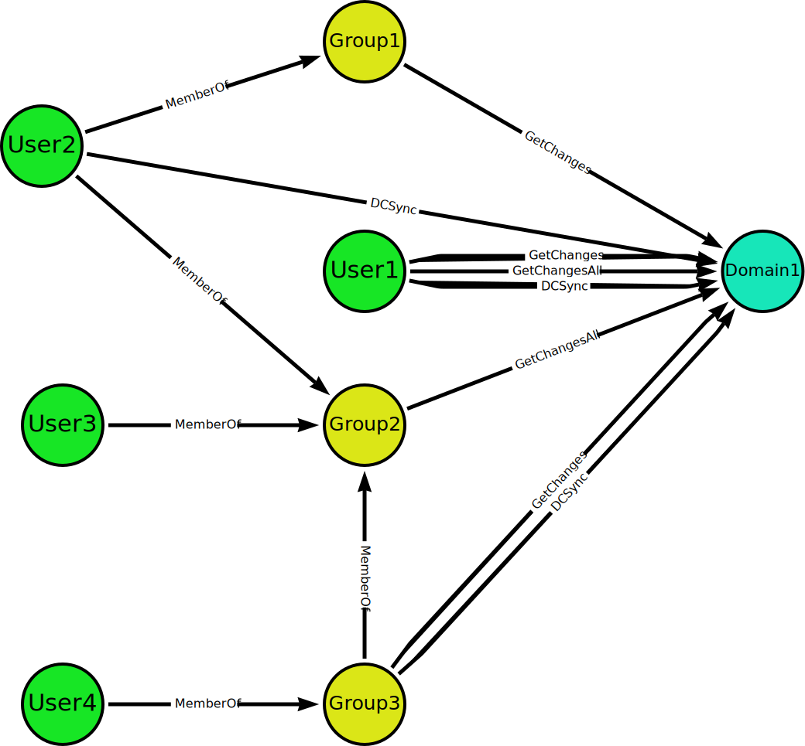
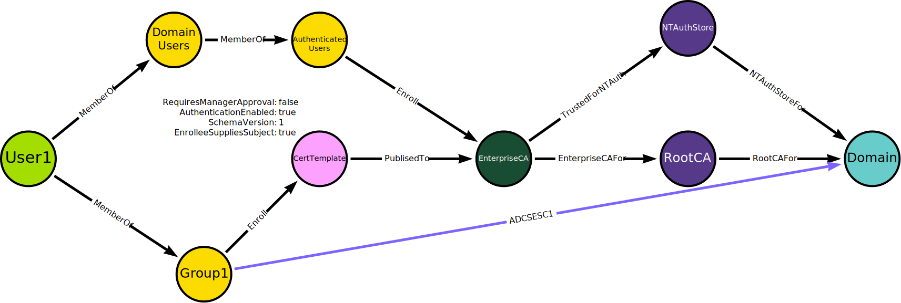

# CalculateCrossProductNodeSets

CalculateCrossProductNodeSets finds the _cross product nodes_, which are the membership intersection of of two or more node sets.

The function is required for post-processed edges that requires a principal to have two or more permissions (edges) in the environment. 

## Example: DCSync

An AD user can perform a DCSync attack if they have GetChanges + GetChangesAll permissions on a Domain node. We create an DCSync edge if an AD node has both a GetChanges and a GetChangesAll edge, potentially through group membership, to a Domain node:

There are two node sets in the case of DCSync - one with the nodes that have an outbound GetChanges edge to the Domain node (Group1, User1, Group3) and another set with the nodes that have an outbound GetChangesAll edge to the same Domain node (User1, Group2). The nodes with DCSync edges are the cross products of those node sets.

Note that User4 has no DCSync edge despite having a path to both GetChanges and GetChangesAll edges. This is because User4 has those paths through Group3, which is the first intersection of the paths. BH users will be able to identify that User4 has the DCSync privileges through the membership of Group3, and we therefore do not return User4 as a cross product and create a DCSync edge.

## Special groups

CalculateCrossProductNodeSets treats the groups Authenticated Users and Everyone specially. All the nodes of the node sets are members of those groups for the specified domain. That is not how we model these groups currently but that is the reality. Therefore, if a node set contains one of these groups, CalculateCrossProductNodeSets skip/ignore this node set as a requirement for cross product nodes to be in.

The primary motivation for having this shortcutting for the special groups is the ADCSESCx edges. They require a node to have enrollment rights on both a CertTemplate node and an EnterpriseCA node. Authenticated Users have enrollment rights on EnterpriseCAs by default and this is rarely changed. That means we often encounter environments with graphs like this one:

In real envrionments, the Group1 group would likely have a lot of members. If we did not have this shortcutting in place, it would be all the members of Group1 that would get an ADCSESC1 edge and potentially appear as individual findings in BHE. Creating the ADCSESC1 edge from Group1 is more logical as it is Group1 that has the permission that enables the attack. It also ensures we create an ADCSESC1 edge in case the group is empty.

