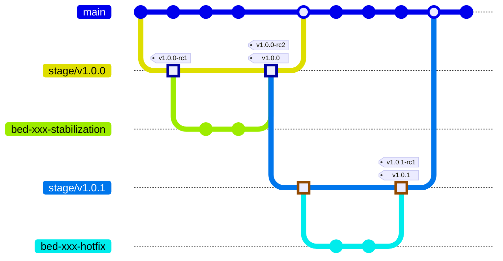

# BloodHound Branching & Release Strategy

## 1. Overview

This document provides a comprehensive overview of the BloodHound branching and release strategy. It serves as the foundation for how code moves from development branches through release branches.

## 2. Motivation & Goals

- **Short-Lived Branches** - Avoid confusion and drift by limiting the number of branches that require long-term maintenance and terminating most branches once their assigned release is complete.
- **Consistent Release Process** - Standardize how we name, manage, and merge release branches.
- **Isolated Fixes** - Ensure hotfixes do not inadvertently pick up unreleased features from the default branch.

## 3. Branch Types

### 3.1 The `main` Branch

- The repository's default branch name is `main`
- This branch is the primary production-ready branch that feature branches originate.
- All changes made to a staging branch are merged to the `main` branch after the release is tested and completed.

### 3.2 Staging Branches: `stage/vX.Y.Z`

- Staging branches are short-lived branches used to prepare a release candidate (RC) for a specific version (X.Y.Z)
- Staging branches are named by combining `stage/v` and the corresponding release candidate's semantic version.
    - E.g. - For release `1.2.3` the name of the staging branch is `stage/v1.2.3`.
- Staging branches for major and minor release versions are branched from the `main` branch.
- Staging branches for patch release versions are branched from the last production tag.
- Staging branches are merged and deleted after the corresponding release has been tested, reviewed, and finalized.
- Staging branches should not squash commits prior to merging into the `main` branch.
- Staging branch pull requests (PRs) can be merged using the "Merge" or "Rebase" strategies.

### 3.3 Feature Branches

- Feature branches are short-lived branches used to develop/enhance product features and fix bugs/defects.
- Feature branches are named by combining the project management issue number and an optional, short, human-readable, and hyphenated description of the work.
    - E.g. - For issue number `bed-1234` the feature branch name could be either `bed-1234` or `bed-1234-my-short-description`. 
- Feature branches are branched from the `main` branch.
- Feature branches are merged into the `main` branch and deleted after the corresponding development work has been tested, reviewed, and approved.
- Feature branches should squash commits prior to merging into the `main` branch when possible.
- Feature branch pull requests (PRs) can be merged using the "Merge", "Rebase", or "Squash" strategies.

### 3.4 Stabilization Branches

- Stabilization branches are short-lived branches used to fix bugs/defects in a given release or staged release.
- Stabilization branches are named by combining the project management issue number and an optional, short, human-readable, and hyphenated description of the work.
    - E.g. - For issue number `bed-1234` the feature branch name could be either `bed-1234` or `bed-1234-my-short-description`.
- Stabilization branches are branched from the corresponding staging branch.
- Stabilization branches are merged into the corresponding staging branch and deleted after their corresponding development work has been tested, reviewed, and approved.
- Stabilization branches should squash commits prior to merging into the corresponding staging branch when possible.
- Stabilization branch pull requests (PRs) can be merged using the "Merge", "Rebase", or "Squash" strategies.

## 4. Versioning

All releases conform to the [Semantic Versioning Specification](semver.org).

### 4.1 Release Candidates

Release candidates are published with the pre-release suffix `-rc` and a non-zero number corresponding to the number of attempts made to produce a stable release. For example, `v1.2.0-rc1`, `v1.2.0-rc2`, etc..

## 5. Release Schedule & Support

### 5.1 Major and Minor Releases

Major and minor releases are delivered semi-continuously on a schedule internally managed by the BloodHound Product and Engineering teams. However, end-users can anticipate a new release at the end of a given release iteration. For example, at the time of this writing a release iteration is considered three weeks; therefore, at the end of a three-week release iteration a new major or minor version will be generally available.

### 5.2 Hotfix/Patch Releases

Hotfix or patched versions are released off-schedule at the discretion of the BloodHound Product and Engineering teams. Hotfix or patched versions are published to address critical defects that can be fixed and sufficiently tested ahead of the next major or minor release.

### 5.3 Support

Due to the nature of the product's continuous delivery cycle, only the latest release is actively supported during a given release iteration. For example, if a critical defect has been identified and the BloodHound Product and Engineering teams agree to author a hotfix/patch release, the fix will exist in the patched version and subsequent versions, however, the fix will not get backported to any earlier version that has the same defect.

## 6. Release Management

### 6.1 Major/Minor Release Process

1. Create a staging branch from `main` for the given release version.
2. Create a Draft PR to merge the staging branch back into the `main` branch.
3. Create a release candidate (See [Section 6.3](#63-creating-a-release-candidate))
4. Validate the release candidate as prescribed by the BloodHound Product and Engineering teams.
5. Resolve any discrepancies discovered during release validation using stabilization branches.
6. Repeat steps 3-5 until the release candidate has completed its prescribed validation.
7. Create the release (See [Section 6.4](#64-creating-a-release))
8. Move the Draft PR into a "Ready for Review" state and merge the branch into `main`.

### 6.2 Hotfix/Patch Release Process

1. Create a staging branch from the latest release's tag for the given patch version.
2. Create a Draft PR to merge the staging branch back into the `main` branch.
3. Create a release candidate (See [Section 6.3](#63-creating-a-release-candidate))
4. Validate the release candidate as prescribed by the BloodHound Product and Engineering teams.
5. Resolve any discrepancies discovered during release validation using stabilization branches.
6. Repeat steps 3-5 until the release candidate has completed its prescribed validation.
7. Create the release (See [Section 6.4](#64-creating-a-release))
8. Move the Draft PR into a "Ready for Review" state and merge the branch into `main`.

### 6.3 Creating a Release Candidate

1. Navigate to the repository's releases page.
2. Select `Draft a new release`.
3. Select `Choose a tag` and enter the release candidate version, prefixed with `v`. E.g. `v1.2.0-rc1` for the first, `v1.2.0-rc2` for the second, etc.
4. Select `Target` and enter the name of the staging branch.
5. Select `Generate Release Notes`, proofread and edit as necessary.
6. Verify the title is set to the complete version string. E.g. - `v1.2.0-rc1`.
7. Select `Set as a pre-release` and ensure `Set as the latest release` is unchecked.
8. Select `Publish release`.

### 6.4 Creating a Release

1. Navigate to the repository's releases page.
2. Select `Draft a new release`.
3. Select `Choose a tag` and enter the release version, prefixed with `v`. E.g. `v1.2.0`.
4. Select `Target` and enter the name of the staging branch.
5. Select `Generate Release Notes`, proofread and edit as necessary.
6. Set the title to the name of the product and include the complete version string. E.g. - `BloodHound CE v1.2.0`.
7. Select `Set as the latest release` and ensure `Set as a pre-release` is unchecked.
8. Select `Publish release`.

