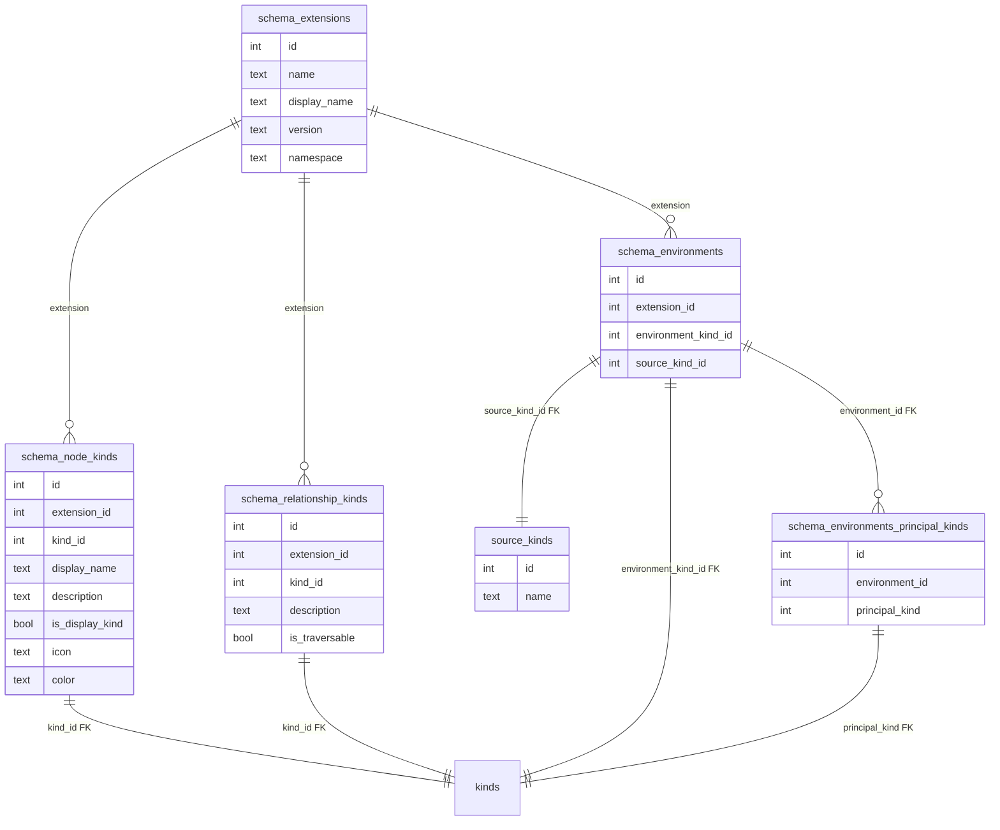

# OpenGraph Extension Fundamental Requirements

## 1. Overview

This RFC introduces **OpenGraph Extensions**, a framework for modularly extending BloodHound’s data models. It mandates that all extension-defined attributes (e.g. node kinds, edge kinds, properties) use a unique namespace prefix to prevent conflicts and ensure traceability.

## 2. Motivation & Goals

### 2.1 Extensibility
OpenGraph Extensions enable BloodHound to support modular, community-driven data model extensions. Without a standardized approach to namespacing, multiple extensions could define conflicting attribute names, leading to data integrity issues and ambiguous ownership of schema elements.

### 2.2 Hybrid Paths
Extensions must be able to define hybrid paths, despite their namespacing requirements. This requirement should be maintainable via referencing other extension's kinds when defining hybrid paths.

### 2.3 Intentional Interactions vs Unintentional Collisions
BloodHound needs to support intentional interactions (such as hybrid paths) implicitly through references, and must avoid unintentional collisions through aggressive namespacing for any extension defined identifiers (node kinds, edge kinds, properties, etc)

- **Avoid Attribute Collisions** - Prevent multiple extensions from defining the same attribute.
- **Clarity of Ownership** - Trace attributes back to their defining extension via prefixes.

## 3. Considerations

### 3.1 Impact on Existing Systems

SharpHound and AzureHound will initially bypass namespace validation to avoid breaking changes. A future migration tool will:

- Add namespaces retroactively (e.g. `AD_` for SharpHound, `EAD_` for Azure/EntraHound).
- No longer bundle these extensions but allow for easy installation.

### 3.2 Security & Compliance

- **No Direct Risks** - Namespacing is a structural constraint, not a security feature.
- **Data Integrity** - Prefixes ensure attribute uniqueness, ensuring schemas have only one source of truth.

### 3.3 Drawbacks & Alternatives

#### 3.3.1 Increased Verbosity

- **Drawback** - Increased verbosity in attribute names (e.g. `GH_User` vs. `User`).
- **Alternative** - Global registry for attribute names (rejected due to centralization).

#### 3.3.2 Multiple Extensions Covering the Same Technology

- **Drawback** - Multiple extensions cannot simply cover the same technology using the same types (e.g. GitHub).
- **Mitigation**:
    - Extensions should be focused on their own domain.
    - Namespacing prevents conflicts. For hybrid paths between technologies, references will be allowed to types in other namespaces.

## 4. Namespace Declaration

Extensions must declare a namespace in their manifest:

```json
{
  "schema": {
    "name": "github_hound",
    "version": "1.0.0",
    "namespace": "GH"
  },
  "node_kinds": [
    {
      "symbol": "GH_User",
      "representation": "Github User",
      "icon": "user",
      "color": "#00FF00"
    }
  ],
  "environments": [
    {
      "environmentKind": "GH_Organization",
      "sourceKind": "GHBase",
      "principalKinds": ["GH_User"]
    }
  ]
}
```

## 5. Attribute Prefixing Rules

- **Format** - `namespace` + `_` + `<type>` (e.g., `GH_User`)
- **Required** - All extension-defined attributes (e.g., `GH_User`, `GH_MemberOf`).
- **Exempt** - References to attributes not defined by the extension (e.g., `"GHBase"` is a source kind).

## 6. Validation

Reject extensions if:

1. Namespace conflicts with an existing extension.
2. Any attribute definition (not reference) lacks the required prefix.

**Example of Invalid Schema**:

```json
{
  "namespace": "GH",
...
  "node_kinds": [
    { "symbol": "User" }
  ]
}
```

The above schema is invalid because `User` should be prefixed with the extension's declared namespace (e.g. `GH_User`).

## 7. Handling Customization

Extensions may include default customization for their attributes in the manifest. These will be stored with the extension but will not overwrite existing user-customized definitions. Examples of customization include node icons and colors, which are currently defined in the `custom_node_kinds` table. Extensions can declare icons and colors, but they will only be written to the actual `custom_node_kinds` table if they do not already exist.

## 8. Kinds Table Handling

Extensions should use junction tables when creating relationships with tables owned by DAWGS (e.g., kinds table). Modifying these tables directly is discouraged for performance and reliability reasons.



## 9. Environments and Principal Kinds

Environments define the security boundary of a user's model (e.g., Domain in Active Directory, Tenant in Azure). Principal kinds are nodes that count toward exposure/impact scores (e.g., User, Computer).

**Example Environment Schema**:

```json
{
  "environments": [
    {
      "environmentKind": "GH_Organization",
      "sourceKind": "GHBase",
      "principalKinds": ["GH_User"]
    }
  ]
}
```

## 10. Validation Rules for Environments

1. Ensure the specified `environmentKind` exists.
2. Ensure the specified `sourceKind` exists (create if it doesn't, reactivate if it does).
3. Ensure all `principalKinds` exist.

## 11. Example Upload Artifacts
### Extension JSON example

```json
{
  "schema": {
    "name": "AzureHound",
    "version": "1.0.0",
    "namespace": "AZ"
  },
  "node_kinds": [
    {
      "name": "AZ_Tenant",
      "display_name": "Azure Tenant",
      "description": "An Azure tenant environment",
      "is_display_kind": "true",
      "icon": "cloud",
      "color": "0xFF00FF",
    },{
      "name": "AZ_Device",
      "display_name": "Azure Device",
      "description": "An Azure device",
      "is_display_kind": "true",
      "icon": "desktop",
      "color": "0x0000FF",
    },
    {
      "name": "AZ_User",
      "display_name": "Azure User",
      "description": "An Azure user account",
      "is_display_kind": "true",
      "icon": "user",
      "color": "0x00FF00",
    },
    {
      "name": "AZ_Group",
      "display_name": "Azure Group",
      "description": "An Azure security or distribution group",
      "is_display_kind": "true",
      "icon": "group",
      "color": "0xFF0000",
    }
  ],
  "relationship_kinds": [
    {
      "name": "AZ_MemberOf",
      "description": "User or computer is a member of a group",
      "is_traversable": false,
    },
    {
      "name": "AZ_HasSession",
      "description": "User has an active session on a device",
      "is_traversable": true,
    }
  ],
  "environments": [
    {
      "environment_kind": "AZ_Tenant",
      "source_kind": "AZBase",
      "principal_kinds": [
      	"AZ_User",
      	"AZ_Group",
      	"AZ_Device"
      ]
    }
  ],
  "relationship_findings": [
    {
      "name": "AZ_GenericAll",
      "display_name": "Generic All Access (Azure)",
      "environment_kind": "AZ_Tenant",
      "relationship_kind": "AZ_HasSession",
      "remediation": {
        "short_description": "Principal has excessive permissions on target",
        "long_description": "This finding indicates that a principal has been granted GenericAll permissions on a target object, providing complete control including read, write, delete, and permission modification rights.",
        "short_remediation": "Remove the GenericAll permission from the principal's access control list",
        "long_remediation": "# Remove Generic All Permissions\n\n## Steps to Remediate:\n\n1. **Identify the affected object**\n2. **Remove excessive permissions**\n3. **Grant minimal required permissions**"
      }
    }
  ]
}
```
