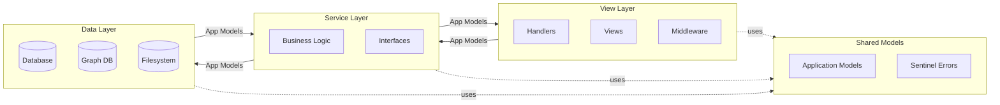
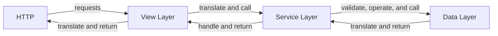
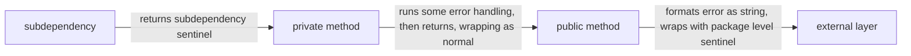
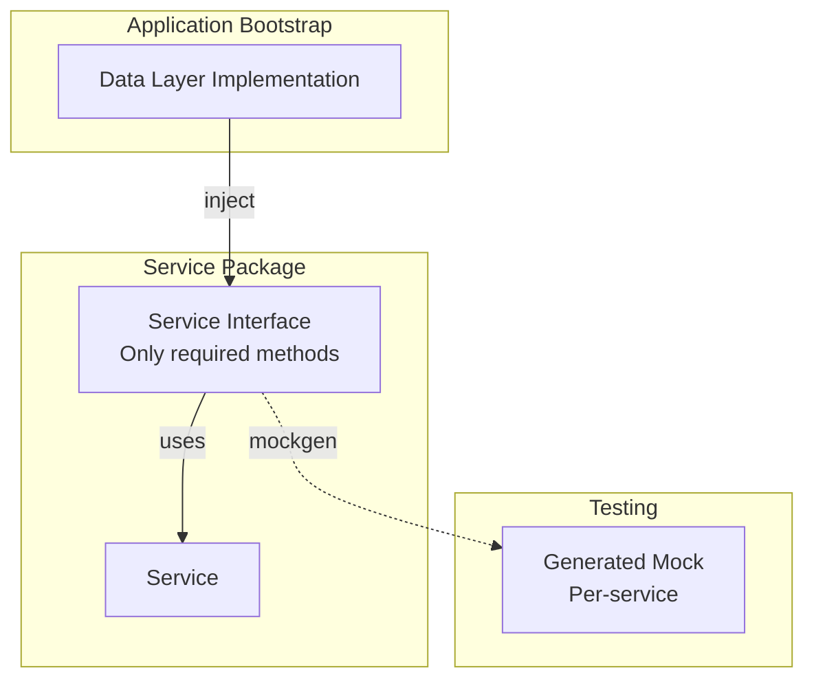
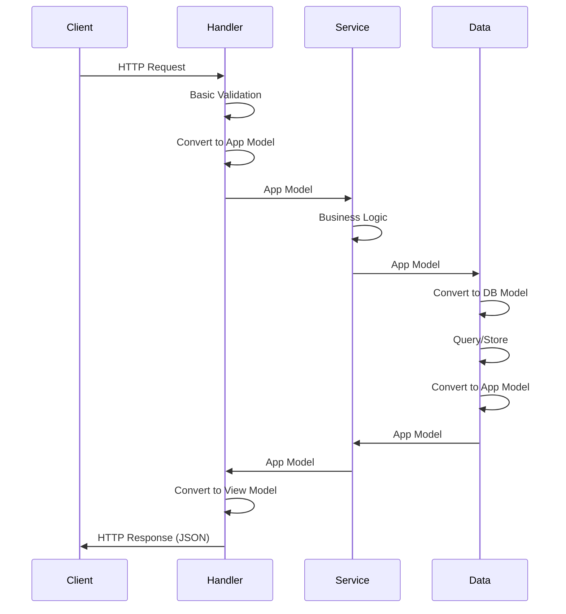

# Layered Architecture for API Separation of Concerns



## 1. Overview

This RFC defines a layered architecture for BloodHound APIs that establishes clear separation of concerns between the data layer, service layer, and view layer. It provides guidelines for model usage, error handling, and dependency management to reduce architectural debt and improve maintainability.

## 2. Motivation & Goals

Our current API layers require updating to establish better-defined boundaries and appropriate separation of concerns. There is significant architectural debt that has been tracked for years, and this document provides guidance on addressing that debt in our new APIs.

- **Separation of Concerns** - Establish clear boundaries between data, service, and view layers to prevent implementation details from leaking across layers.
- **Model Independence** - Move away from a single shared model to layer-specific models that protect API contracts from unintended drift.
- **Error Handling** - Define consistent error handling patterns that prevent external dependency error types from crossing layer boundaries.
- **Dependency Isolation** - Enable incremental refactoring by ensuring layers depend on interfaces rather than concrete implementations.
- **Maintainability** - Create an architecture that engineers want to maintain, following the "no broken windows" philosophy.

## 3. Considerations

### 3.1 Guiding Philosophy

No broken windows. If something bothers us about the current way things are done (e.g., API filtering logic), we should address it. Part of defining a clearer separation of concerns is to bring it in line with what engineers would actually want to maintain. YAGNI still applies—start with the simplest solution and let it grow organically, abstracting when necessary rather than before the lack of abstraction causes actual pain.

### 3.2 Impact on Existing Systems

This proposal affects the existing database package, graph querying packages (including dawgs), API handlers, and shared model definitions. Migration should be incremental, implementing one service's interface at a time rather than requiring a complete refactor in one step.

### 3.3 Implementation Plan

Refactors should be doable without changing services beyond which data layer is injected to a specific service. By interfacing dependencies, underlying data layers or libraries can be swapped out incrementally as long as they provide the same interface that the service needs.

## 4. Models

### 4.1 Layer-Specific Models

Each layer should own its own model types:

- **Database Layer** - Owns structs that represent the current state of database entities.
- **View Layer** - Owns view structs that represent the API contract, ensuring stability despite changes to the database or underlying services.
- **Application-wide Models** - Shared models used for transferring data in a standard way between layer boundaries, devoid of database or JSON tags.

### 4.2 Model Translation Flow



### 4.3 Benefits

This approach allows each layer to be updated without significant changes in other layers. It prevents unintended contract drift by requiring explicit translation between models at layer boundaries.

## 5. Error Types

### 5.1 Error Boundary Rules

Public error types must not cross boundaries. Each layer should:

1. Convert errors to strings at the public boundary.
2. Wrap error strings with layer-specific sentinel errors before returning.
3. Avoid leaking error types of dependencies of the layer to prevent implicit contracts with higher layers.

### 5.2 Example

```go
var ErrNotFound = errors.New("not found")
...
err := gorm.ThingThatErrors() // This returns a gorm.ErrNotFound
if err != nil {
  // Note that the error is converted to a string, then wrapped with an appropriate sentinel
  return fmt.Errorf("%w: %s", ErrNotFound, err)
}
...
```



### 5.3 Sentinel Error Registry

Error types are part of a package's implicit API contract. Layers should either define their own sentinels or use a shared application registry of sentinel errors (a separate errors package that all layers import).

## 6. Data Layer

### 6.1 Responsibilities

The data layer abstracts access to data away from the service layer. It focuses on data access with limited to no business logic present. Current components include the database package, graph querying packages (including dawgs), and filesystem access.

### 6.2 Design Principles

- Packages should provide methods, not their own interfaces.
- Can be monolithic like the existing DB struct, or broken up along useful boundaries.
- Methods should always take and return application-wide types (typically declared in models).
- Internal conversion between application types and data layer-specific types should occur within the layer.

### 6.3 Transaction Handling

Services may need transaction objects that can be injected into additional database calls. The underlying transaction should remain private to the data layer. This allows the underlying database implementation to change without affecting the service layer.

## 7. Service Layer

### 7.1 Responsibilities

The service layer is where all business logic should be defined and wire-up for data access occurs. Services communicate with other layers using shared models and shared errors.

### 7.2 Dependency Injection

Services must be wired up during application bootstrap by injecting dependencies. Dependencies should be accepted using interfaces that the service controls. These interfaces should only cover the methods the service actually uses, not all methods the dependency provides.



### 7.3 Benefits

- Services keep smaller interfaces on the consumer side where they belong.
- Mocks will be per-service instead of global.
- Services no longer need to import multiple mock packages.
- Service packages will need to set up mockgen for their interfaces.

## 8. View Layer

### 8.1 Responsibilities

The view layer interfaces with the outside world. Currently, the primary view layer consists of versioned API handlers, views, and middleware packages.

### 8.2 Handler Behavior

Handlers should:

1. Have one or more services injected for business logic.
2. Take HTTP request information and perform basic validations.
3. Negotiate HTTP errors as needed.
4. Convert HTTP request data into application types.
5. Call service methods to process data.
6. Convert resulting application data into view forms.



### 8.3 Views

Views are types that map application models into externally formatted types. This typically means structs with JSON tags, but could include methods for CSV views or other transformations. This ensures most changes to application models will not leak into API contracts.

### 8.4 Future Extensibility

The separated view layer supports multiple API versions and could accommodate additional views such as HTMX or Wails in the future.
